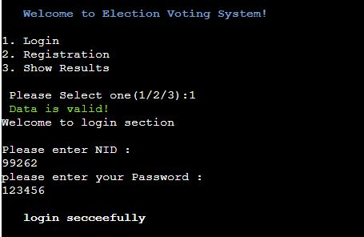

# Election System

Election System is my third portfolio project for code institute(Diploma of Full Stack Software Development.),  on this project we focuse on backend functionality with the Python.

This is an online system for voting, every person should register their name at first, after registration they can login to system and vote for their considered candidate. we using Google Sheet(one sheet for users, one for candidate and one for votes).

While users want to register their self, we need for Name, National ID(NID), DOB(year) and Password.
This system can accept only unique NID, and will not accept duplicate NID while registering, by using DOB(year) system will allow only those users which have more than 18 years old.

After registration complete, users can log in to system by using their NID and password. and system will display the candidate list which comes from Excel sheet (Candidate sheet), after choosing the considered candidate the vote going to save on google sheet (votes sheet), and display the success message.

 Link to the live site - [Election System](https://sadafsafi22.github.io/To-do-list/)

 **September 17, 2022**

## Contents

## Features

As we know this is a backend program, and we have some functionality,
- First allows user to select one option
    - Login
    - Registration
    - Show Result
        

## Login Option

If user already register their self and have account they can select login option and by using thier National ID (NID) and Password login to system

## Registration Option

If user want to register their self by this option they can do that,
for registration system need Name, National ID(NID), DOB(year) and Password. as shown in below image after selecting 2 for this option system move to regisration form and ask for their information.
 

* Name
    - Election System can accept everything(string and number) for name
    

* National ID (NID)
    - National ID has a unique number for everyone, and Election System can not accept duplicate cuz everyone can register their name, only and only a time and can vote for one time.
    

    - if user enter dupicate NID system display " Sorry  , This 99262 NID already registrated, we can not accept duplicate" and ask for new NID and after accepting the new NID it will continue for next input
    

* DOB(year)
    - On this input we request form user to enter year of their birth, and we check for validation  if they user have more then 18 year old or not, if yes the form will continue for next input, if not the process end and display a msg like the image
    

* Password
    - The last input for registration is password and it will accept (alphabet and numbers with characters) for password. after entering this registration complete and display message and go for login form
    
    
## Voting Form
After Registering and login to system Successfully, The voting form will display automatically, and candidate list will be shown to user and allow them to select their considerate candidate. as shown in below image.

- After selecting the candidate system will display a message and your vote is casted
    

## Show Result
Show result option, display the result for all votes, it will display number of vote for each candidate, show the percentage of votes for each candidate as will

## Reminders

* Your code must be placed in the `run.py` file
* Your dependencies must be placed in the `requirements.txt` file
* Do not edit any of the other files or your code may not deploy properly

## Creating the Heroku app

When you create the app, you will need to add two buildpacks from the _Settings_ tab. The ordering is as follows:

1. `heroku/python`
2. `heroku/nodejs`

You must then create a _Config Var_ called `PORT`. Set this to `8000`

If you have credentials, such as in the Love Sandwiches project, you must create another _Config Var_ called `CREDS` and paste the JSON into the value field.

Connect your GitHub repository and deploy as normal.

## Constraints

The deployment terminal is set to 80 columns by 24 rows. That means that each line of text needs to be 80 characters or less otherwise it will be wrapped onto a second line.

-----
Happy coding!