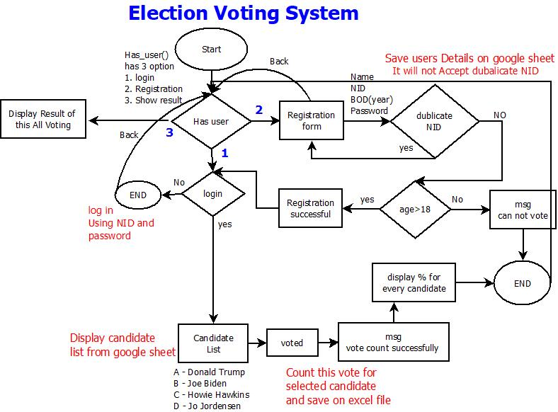
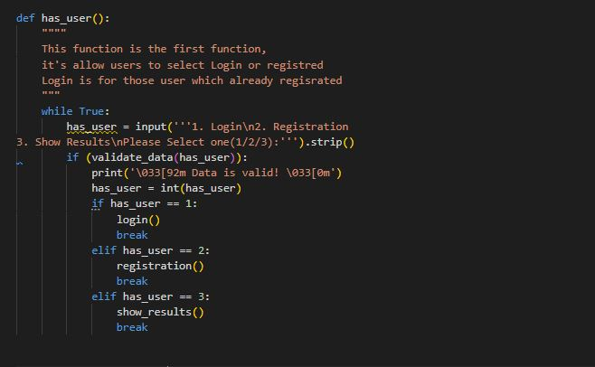
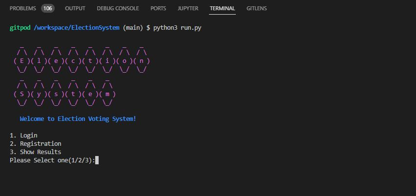

# Election System

Election System is my third portfolio project for code institute(Diploma of Full Stack Software Development.),  on this project we focuse on backend functionality with the Python.

This is an online system for voting, every person should register their name at first, after registration they can login to system and vote for their considered candidate. we using Google Sheet(one sheet for users, one for candidate and one for votes).

While users want to register their self, we need for Name, National ID(NID), DOB(year) and Password.
This system can accept only unique NID, and will not accept duplicate NID while registering, by using DOB(year) system will allow only those users which have more than 18 years old.

After registration complete, users can log in to system by using their NID and password. and system will display the candidate list which comes from Excel sheet (Candidate sheet), after choosing the considered candidate the vote going to save on google sheet (votes sheet), and display the success message.

 Link to the live site - [Election System](https://election-online-system.herokuapp.com/)

 **September 17, 2022**


## Contents

* [**Features**](<#features>)
* [**Login Option**](<#login-option>)
* [**Registration Option**](<#registration-option>)
* [**Voting Form**](<#voting-form>)
* [**Show Result**](<#show-result>)
* [**Data Model**](<#data-model>)
* [**Back-end Code Explanation**](<#back-end-code-explanation>)
    * [**welcome_msg Function**](<#back-end-code-explanation>)
    * [**has_user function**](<#back-end-code-explanation>)
    * [**validate_data function**](<#back-end-code-explanation>)
    * [**login function**](<#back-end-code-explanation>)
    * [**registration function**](<#back-end-code-explanation>)
    * [**check-age function**](<#back-end-code-explanation>)
    * [**candidate-list fucntion**](<#back-end-code-explanation>)
    * [**vote_count function**](<#back-end-code-explanation>)
    * [**show_result function**](<#back-end-code-explanation>)
    * [**is_integer function**](<#is_integer-function>)
    * [**back_function**](<#back_function>)
* [**Testing**](<#testing>)
    * [**Validator Tests**](<#validator-tests>)
    * [**Terminal Tests**](<#terminal-tests>)
    * [**Input Tests**](<#input-tests>)
* [**Technologies**](<#technologies>)
* [**Deployment**](<#deployment>)
* [**Credits**](<#credits>)
* [**Acknowledgements**](<#acknowledgements>)


## Features

- First allows user to select one option
    - Login
    - Registration
    - Show Result

        

## Login Option

If user already register their self and have account they can select login option and by using thier National ID (NID) and Password login to system


## Registration Option

If user want to register their self by this option they can do that,
for registration system need Name, National ID(NID), DOB(year) and Password. as shown in below image after selecting 2 for this option system move to regisration form and ask for their information.

 

* Name
    - Election System can accept everything(string) for name

    

* National ID (NID)
    - National ID has a unique number for everyone, and Election System can not accept duplicate becuses everyone can register their name, only and only a time and can vote for one time.

    

    - if user enter dupicate NID system display " Sorry  , This 99262 NID already registrated, we can not accept duplicate" and ask for new NID and after accepting the new NID it will continue for next input

    

* DOB(year)
    - On this input we request form user to enter year of their birth, and we check for validation  if they user have more then 18 year old or not, if yes the form will continue for next input, if not the process end and display a msg like the image

    

* Password
    - The last input for registration is password and it will accept (alphabet and numbers with characters) for password. after entering this registration complete and display message and go for login form

    
    
## Voting Form
After Registering and login to system Successfully, The voting form will display automatically, and candidate list will be shown to user and allow them to select their considerate candidate. as shown in below image.


- After selecting the candidate system will display a message and your vote is casted

    

## Show Result
Show result option, display the result for all votes, it will display number of vote for each candidate, show the percentage of votes for each candidate as will


## Data Model
This is a Diagram for this Election System project, which is darwing on dia Application




## Back-end Code Explanation

This is a simple terminal python project, here i want to explain some of my code which written for this project. i'm using google sheet for storing data on excel file it's why import gspread, Credentials, importing datetime becuses i wnat to use date function to calculate age from year of born, importing Counter becuses wanna to display some arry count and importing title_art becuses on that file a create "Election System" with ASCII for the first time runing.

written some code to access the excel file from google sheet.
we have 3 sheets which are "users" , "candidate" , "votes" as showing in the image we access each sheet by their names.

## welcome_msg Function
Print out one art which come from title.py and simple welcome msg


### has_user function
this is the first function which allow users to select login, register or show result 



### validate_data function
this validate function is using for valiate the entering data for has_user function


### login function
login function is using for requesting user to enter NID and Password and checking if correct or false.


### registration function
on this function users can register thier self at system


### check-age function
check-age function is user to check if the person who's registering have age more then 18 or not, if yes return true if not return false and display a message


### candidate-list fucntion
candidate-list function is getting list of candidate from excel sheet and display to user and after selecting the condiseret candidate save the result to Excel sheet


### vote_count function
this function get all votes from excel sheet and count them for each candidate and display for user while selecting Show Result from menu 


### show_result function
show result function is going to display result of votes and precentage of votes for each candidate


### back_function
back function is using when user type back on terminal and move the program to start function which is has_user function 


## Testing
The Election has been tested extensively for bugs and errors throughout the development process.

### Validator Tests
Python project code has been passed through the [PEP8 online python validator tester](http://pep8online.com/). No errors were shown.


### Terminal Tests
Election System Project has been tested with Gitpod terminal text editor and working well with no errors and bugs



### Input Tests
we test our program by different inputs for example on main menu(has_user function) we need only 1,2,3 if user type something else the system will not accept that and display an error


login function when system request NID it will not accept white space, String and characters and password as well not accept space


Register function Testing
1. Name: on this input it ask only for string and cann't accept number and white space for it.


2. NID : can only accept number.


3. Year of Born: this function can accept number and number should be year of born, and check if your age in less then 18 it will forward you on first function 


4. Password: password can be anything 


by typing back on every stage of program it move us to has_user function 


## Technologies
* [Python](https://www.python.org/) - Python is a programming langauge using for this project.
* [Heroku](https://www.heroku.com) - Heroku is a platform as a service (PaaS) that enables developers to build, run, and operate applications entirely in the cloud. and we are using this platform for hosting our online system.
* [GitPod](https://gitpod.io/) - An open source developer platform for remote development. Used to edit and build the program. this project is using GitPod for developmenting and coding and it really make everything easy and simple for developer.
* [GitHub](https://github.com/) - An online host for web and software development projects. Used to store the repository. Linked to Heroku for automatic deployement with new commits. github is using for storing our project data and shareing with other people. 
* [Git](https://git-scm.com/) - Software for tracking changes to files. Used with GitPod to add, commit and push code changes to the repository on GitHub.for this project we are using the git to track our development stage
* [patorjk](http://patorjk.com/) - A simple app used to Create text art from words, im using this for create the Election system on first time display(ELECTION SYSTEM)
* [dia](http://dia-installer.de/) - Dia is free (open source) drawing software. Sketch your favorite structured diagrams! Windows version available as a free download, we use this appliction for draw our system Diagram which is avalible on README file.
* [Google sheet](https://www.google.com/sheets/about/) - Use Google Sheets to create and edit online spreadsheets. Get insights together with secure sharing in real-time and from any device, here we use google sheet to store the userdata(registrated student data should store here) and store the votes from every user.


## Deployment
Project Deployment with Heroku
Here is some steps for delopy Election System via Heroku.

1. Listing all requirement on requirements.txt by using below commend(user should create this requirments)
```bash
pip3 freeze > requirements.txt
``` 

2. Creating Credentials for google sheet using this referance [Google Sheet Credentials](https://medium.com/@a.marenkov/how-to-get-credentials-for-google-sheets-456b7e88c430)
3. Add, commit and push new changes to GitHub.
4. Go [Heroku](https://www.heroku.com) on the browser and create an account and login.
5. Once the account is create/open , go to "New" and look for "Create new app"
6. Type an App Name(which should be unique on Heroku) and select the local region from dropdown box.
7. After create App the dashborad will display click on "Setting" tab in the menubar. Scroll down and add "Config Vars" any Sensitive information which not sent to github.
8. For projects using the Code Institute terminal, another Config Var needs to be added into this section. Enter "PORT" in all capitals into the "Key" field and "8000" into the "Value" field and click the "Add" button.
9. for using python project "Buildpacks" section click "Add buildpack" and select python and node.js
10. On the top of the page select Delopy from menu
11. on Delopy page scroll down to the "Deployment method" section click and select "GitHub" option to connect Heroku to the repository on GitHub. Click "Connect to GitHub", login to Github in the pop-up window if required, otherwise this should be done automatically.
12. In the 'connect to GitHub' section enter the repository name which your mentioned project exist on GitHub
13. If the last step was successful the "Deploy" page should change. Scroll down the page to the "Automatic deploys" and "Manual deploy" sections. To enable automatic deploys with each new GitHub push click the "Enable Automatic Deploys" button. To manually deploy click the "Deploy branch" button in the "Manual deploy" section. Ensure the "main"/"master" branch is selected from the drop down menus for both of these options if that is the latest branch of the project.
14. If deployment is successful a prompt should appear with a "View" button to view the deployed app. Click the button to view the app deployment.

Your site is published at [Election System](https://election-online-system.herokuapp.com/)

## Credits
- Content 
    - The Election System Project developed all by developer. 
- Media
    - The Election System ASCII work-art title in a font called ANSI shadow from [patorjk](http://patorjk.com/)

## Acknowledgements
- My Mentor for constant feedback.
- My Husband Walid Ahmadyar for inspiration, support and useful comments
    